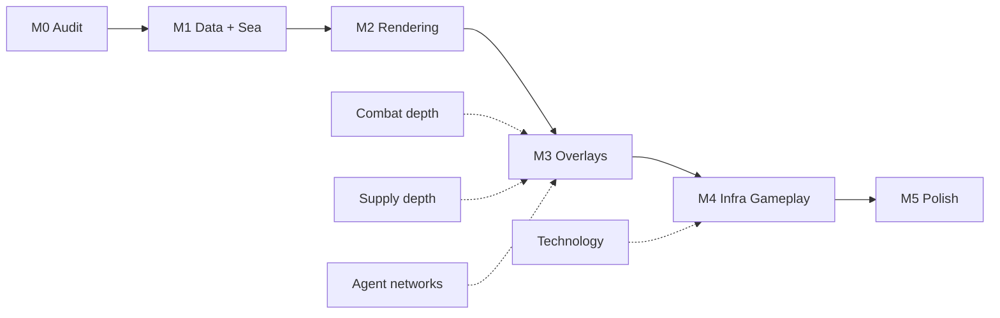

# Map System Design Plan — Epochs of Ascendancy

**Status:** Design / roadmap  
**Last updated:** May 2026  
**Audience:** Small team building in Godot 4.x  
**Related:** `data/provinces/SCHEMA.md`, `scripts/data/Province.gd`, `scripts/map/MapRenderer.gd`, `scripts/core/ScenarioLoader.gd`, `docs/UI_DESIGN_REFERENCE.md`

---

## Executive summary

The project **already has the right HOI4-style foundation**: JSON-layered province data, polygon geometry in map pixel space, adjacency with straits, scenario overrides, and gameplay getters on `Province.gd`. The upgrade path is **not a rewrite**—it is **scaling data authoring, rendering performance, and map-native UX** while keeping `ScenarioLoader` + Manager autoloads as the integration hub.

**Recommended posture:** Stabilize gameplay on the current ~90-province map, then invest in **Phase M1–M2 (data + rendering)** in parallel with deeper Combat/Supply, before attempting a full-world 3,000-province import.

---

## 1. Overall vision and scope

### 1.1 What “success” looks like

A HOI4++ map for Epochs of Ascendancy should provide:

| Layer | Player-facing role |
|-------|-------------------|
| **Land provinces** | Ownable polygons with terrain, dev, infra, VP, cores, factories, special sites |
| **Sea zones** | Navigable polygons (`is_sea`) for naval movement, convoys, port adjacency, amphibious hops |
| **States / regions** | Grouping for supply hubs, strategic region modifiers, AI focus, UI filters |
| **Supply graph** | Visible hubs, routes (land/sea/air), interdiction, depot fill—already started via `SupplyMapLayer` |
| **Conflict overlays** | Front lines, contested controller vs owner, battle width preview, agent network strength |
| **Era readability** | Same geography across 1918 / 1936 / 2026 / 2040+ with scenario diffs, not separate maps |

The map is a **gameplay board**, not decoration. Every visual channel should answer: *“Can I fight here, supply here, build here, spy here?”*

### 1.2 Timeline coverage (1900–2050+)

| Era band | Map emphasis |
|----------|----------------|
| **1900–1918** | Rail/road infra low, few airfields, coastal ports dominant |
| **1919–1938** | Industrial provinces, tank/air plants via technology, doctrine schools |
| **1936–1955** | Dense land combat width, dense factory placement |
| **1946–1989** | SAM sites, early spaceports (scenario-gated) |
| **1970–2030** | Network-centric supply, high dev hubs |
| **2020–2040** | Near-future units, spaceports, orbital industry flags |
| **2040–2050+** | `strategic_future` megaproject sites, “far future” swimlane UI on same polygons |

**Design rule:** One canonical world topology; **scenario JSON** and **per-era economy layers** change owners, dev, factories, and unlocked buildings—not province IDs.

### 1.3 Scope boundaries (realistic for a small team)

**In scope (this plan):**

- Polygonal provinces + sea zones up to ~400 provinces (MVP scale-up), path to ~1,500 with LOD
- JSON authoring pipeline and validation tools
- MapManager façade, overlay system, retrowave map UI
- Integration hooks for Combat, Supply, Agents, Technology (already partially wired)

**Out of scope (defer):**

- Full HOI4 clone province count (~13k) without dedicated tooling hire
- 3D globe / Terra Invicta orbital view (separate “strategic space” screen later)
- Procedural world generation from scratch
- Real-time terrain deformation or dynamic borders mid-battle (use controller/owner tags first)

---

## 2. Technical architecture

### 2.1 Recommended Godot 4 approach

**Keep polygon-first (HOI4 model).** Do not replace land provinces with a tilemap; tiles are useful only as **underlay** or **LOD simplification**.

```
┌─────────────────────────────────────────────────────────────┐
│  CanvasLayer (UI): tooltips, InfoPanel, overlays, minimap   │
├─────────────────────────────────────────────────────────────┤
│  MapView (Node2D)                                           │
│    ├─ BackgroundSprite (optional 4K political texture)      │
│    ├─ ProvinceMeshLayer (batched polygons, country colors)  │
│    ├─ BorderLineLayer (province borders, LOD gated)         │
│    ├─ FeatureIconLayer (ports, forts, capitals)             │
│    ├─ SupplyMapLayer (routes — exists)                      │
│    ├─ AgentNetworkLayer (rings — planned)                   │
│    ├─ ConflictOverlayLayer (front/contested — planned)      │
│    └─ InteractionLayer (pick map, spatial index)            │
├─────────────────────────────────────────────────────────────┤
│  CameraController (pan/zoom, bounds, zoom bands)            │
└─────────────────────────────────────────────────────────────┘
```

| Approach | Verdict | Notes |
|----------|---------|-------|
| **Per-province `Area2D` + `Polygon2D`** (current) | Good for ≤150 provinces | Simple; degrades with thousands of nodes |
| **Batched `MeshInstance2D` / custom `CanvasItem` draw** | **Target for M2** | One draw call per country or per terrain bucket |
| **TileMap underlay** | Optional hybrid | Low-zoom context only; polygons remain authoritative |
| **NavigationRegion2D** | Avoid for provinces | Use `AdjacencySystem` graph, already correct for strategy |

### 2.2 Province data model (extend, don’t fork)

Keep `Province` as the **runtime gameplay object** (`class_name Province extends Resource`). Add fields incrementally; keep heavy geometry out of it.

**Today (keep):**

- Identity: `id`, `name`, `terrain`, `is_sea`, `has_port`, `coordinates`, `adjacencies`
- Politics: `owner_tag`, `controller_tag`, `core_for`
- Economy: `development_level`, `infrastructure`, `factories`, `population`, `resources`, `victory_points`
- Features: `special_features`, `tags`

**Proposed additions (phased):**

| Field / companion | Purpose |
|-------------------|---------|
| `state_id`, `strategic_region_id` | Fast UI filters; already loaded in `ScenarioLoader` maps |
| `supply_hub_kind` | Capital / major / minor / none (align with `ProvinceSupplyHub`) |
| `movement_cost_override` | From `province_terrain_layer.json` |
| `combat_terrain_tag` | Normalized key for `CombatWidthCalculator` |
| `era_tags[]` | e.g. `["industrial_war", "near_future"]` for overlay greying |
| `build_slots_used` / `build_queue` | Technology + production placement (later) |

**Geometry stays external:**

- `provinces_geometry.json` → points in **map pixel space** (4096×2048 today)
- At scale, consider **normalized UV space** `[0,1]` × texture size to survive resolution changes

**Computed getters (keep on `Province`; aggregate in `ProvinceEffects`):**

- Supply: `get_supply_throughput_modifier()`, `get_local_supply_generation_modifier()`, `get_interdiction_resistance_modifier()`
- Combat: `get_combat_width_modifier()`, `get_organization_recovery_modifier()`, `get_attrition_modifier()`
- Movement: `get_movement_cost()`, `get_logistics_quality()`, `get_reinforcement_speed_modifier()`

`ProvinceEffects` should become the **single query API** for UI and AI:

```gdscript
# Target pattern (already started)
var fx := ProvinceEffects.new(province, NationalModifierManager.get_combined(tag))
fx.get_effective_combat_width_multiplier()
```

### 2.3 Data pipeline (authoring → game)

**Principle:** Designers edit **layers**, not monolithic scenario blobs.

```
Authoring tools (external)          Repo (JSON)                 Runtime
─────────────────────────          ───────────                 ───────
QGIS / Inkscape / custom      →    provinces_geometry.json  →  ScenarioLoader
Spreadsheet / Airtable        →    province_economy_layer   →  merge into Province
Scenario editors              →    data/scenarios/*.json    →  owner/dev/factory overrides
Validation (CI)               →    tools/validate_province_layers.py
```

**Pipeline steps:**

1. **Draw / import polygons** → export GeoJSON or CSV points → convert to `provinces_geometry.json` (script in `tools/`)
2. **Auto-adjacency** → edge-shared detection + manual strait edges in `province_adjacency.json` (`AdjacencySystem` already supports `straits`)
3. **Paint terrain / sea** → `province_terrain_layer.json`, set `is_sea` on Province
4. **Place cities & hubs** → `province_city_layer.json` (port/airport/industry slots)
5. **Assign economy** → `province_economy_layer.json` + scenario overrides
6. **Group states/regions** → `province_states.json`, `strategic_regions.json`
7. **Validate** → `tools/validate_province_layers.py` (extend: closed polygons, no orphan IDs, adjacency symmetry)

**Versioning:** Bump `meta.version` in geometry file when coordinates change; scenarios reference `min_geometry_version` if needed.

### 2.4 Performance considerations

| Scale | Provinces | Strategy |
|-------|-----------|----------|
| **Now** | ~90 | Per-node `Area2D` acceptable |
| **MVP** | 200–400 | Country-batched meshes; spatial hash pick |
| **Stretch** | 1,000–1,500 | LOD: simplify polygons at zoom < 0.4; hide labels |
| **HOI4-class** | 3,000+ | Requires tooling budget; merged static meshes + pick buffer |

**Hot paths to optimize:**

- **Picking:** Grid hash on centroids (cell size ~64px) instead of 3,000 areas
- **Redraw:** `queue_redraw()` on overlay layers only when supply routes or owners change
- **Colors:** Diff country fill textures when owner changes, not per-province material swap
- **Labels:** `MultiMesh` or single `Label` pool; show names only above `province_detail_min_zoom` (already gated in `MapRenderer`)

**Memory:** Keep geometry in a packed format at load (PackedVector2Array per id in a single `MapGeometry` resource).

### 2.5 MapManager autoload (recommended)

Introduce `MapManager` (or `WorldMapController`) as façade:

- Holds reference to active `provinces`, `adjacency_system`, `geometry`
- Emits: `province_selected`, `province_hovered`, `owner_changed`, `overlay_mode_changed`
- Resolves `ProvinceEffects` for a tag + province id
- Decouples `CombatResolver` / `SupplyManager` from `find_child("ScenarioLoader")`

This matches existing patterns (`TechnologyManager`, `SupplyManager`, `LeaderManager`).

---

## 3. Core systems integration

### 3.1 Combat

| Map concept | System hook |
|-------------|-------------|
| Terrain | `province_terrain_layer` + `Province.terrain` → `CombatWidthCalculator.get_terrain_width_modifier()` |
| Infra + dev | `Province.infrastructure`, `development_level` → `CombatResolver.get_combat_width_for_battle()` |
| Province mods | `get_combat_width_modifier()`, `get_organization_recovery_modifier()` via `ProvinceEffects` |
| Preview UI | `ProvinceInsight` + selected/adjacent provinces (implemented) |

**Map responsibilities:**

- Battle location = **defender province** polygon (HOI4 convention)
- Show **effective width** and terrain mod in tooltip; optional arrow overlay attacker → defender
- Later: front-line shader where adjacent enemy-controlled provinces meet

**CombatResolver improvement (no map rewrite):** Pass explicit `Province` objects into `get_effective_combat_power()` instead of terrain-only proxy bonuses.

### 3.2 Supply

| Map concept | System hook |
|-------------|-------------|
| Hubs | `ProvinceSupplyHub` per province; capital from scenario country |
| Throughput | `get_supply_throughput_modifier()` + hub infra/dev in `SupplyManager._init_depot_states()` |
| Routes | `SupplyMultimodalRouter` + `SupplyMapLayer` polyline draw |
| Interdiction | Route path averages `get_interdiction_resistance_modifier()` per friendly province |
| Sea | `is_sea` provinces + port adjacency via `resolve_has_port()` |

**Map responsibilities:**

- Toggle overlay (L key today) → color routes by mode (land/sea/air)
- Depot fill **heat tint** on province fill (green/yellow/red)
- Click-to-reroute (exists); extend with **hub badges** (capital star, major depot ring)

### 3.3 Agents / networks

| Map concept | System hook |
|-------------|-------------|
| `AgentNetwork` | `province_id`, `strength`, `focus`, `detection_risk_accumulated` |
| Missions | Already province-targeted in `AgentManager` |
| Effects | Future: temporary `Province` debuffs via `NationalModifierManager` province scope |

**Map responsibilities:**

- **Network ring** icon per province (opacity = strength)
- **Contested intel** hatching when enemy presence + friendly network overlap
- Click province → jump to Agent screen with province filter

### 3.4 Technology

| Map concept | System hook |
|-------------|-------------|
| Special features | `port`, `shipyard`, `spaceport`, etc. with levels |
| Unlocks | `TechnologyUnlockRegistry`: `factory_type`, `building`, `rule_flag` |
| Gating | `FactoryManager` / `ProductionManager` check province features |

**Map responsibilities:**

- Show **locked** building slots (padlock) vs **unlocked** (icon from `special_features`)
- Construction mode: highlight valid provinces for `allow_port_shipyard_conversion` etc.
- Era filter: grey nodes in technology graph already mirror map “epoch” tags—sync `Province.era_tags` when authoring

### 3.5 Modifier layering (canonical order)

```
Base province getters (Province.gd)
  → ProvinceEffects (national spirits + temporary)
    → Technology / buildings (rule flags, local caps)
      → Agent networks (local sabotage / intel)
        → CombatResolver / SupplyManager (final application)
```

Map UI always displays **effective** values from `ProvinceEffects` + tooltip breakdown (base → national → local).

---

## 4. UI and interaction

### 4.1 Selection and information

**Current (keep improving):**

- Click province → `InfoPanel` (owner, economy, logistics, combat blocks)
- Hover → `ProvinceHoverTooltip` (multi-line, battle preview vs selection)

**Target:**

| Interaction | Behavior |
|-------------|----------|
| Hover | Rich tooltip; delay 150ms; hide on fast pan |
| Click | Select + panel; shift-click compare second province |
| Double-click | Open relevant screen (factory list, agents, supply planner) |
| Right-click | Context menu (move capital hub, assign agent, route here) |

**Progressive disclosure** (per `UI_DESIGN_REFERENCE.md`):

- Line 1: name, owner, controller, VP
- Line 2: dev / infra / terrain
- Expand: supply depot, combat preview, networks, modifiers list

### 4.2 Camera behavior

Extend `CameraController` / `MapRenderer` zoom bands:

| Zoom | View |
|------|------|
| 0.15–0.35 | Strategic: country fills only, region labels, no province names |
| 0.35–0.8 | Operational: province borders, capitals, supply overlay readable |
| 0.8–2.0 | Tactical: province names, feature icons, full tooltips |
| 2.0+ | Debug/authoring (optional grid, IDs) |

**Controls (retain):** wheel zoom to cursor, WASD, edge scroll, middle-drag—already solid for prototype.

**Bounds:** Clamp camera to map texture rect from `provinces_geometry.meta.texture_size`.

### 4.3 Visual feedback channels

Use **retrowave** palette from Leader/Agent screens:

- Panel: dark blue-grey fill `#1e1e2e`, cyan border `#4a90e2`
- Accent: magenta for warnings, amber for contested, cyan for selection

| State | Visual |
|-------|--------|
| Owner fill | Country color @ 85% alpha (current) |
| Controller ≠ owner | Diagonal stripe overlay |
| Selected | White outline + soft glow |
| Hovered | Scale 1.05 (current) + tooltip |
| High development | Subtle inner brighten (shader uniform) |
| Low supply depot | Red pulse on hub icon |
| Active battle | Crossed swords icon (future) |
| Agent network | Purple ring, thickness ∝ strength |

### 4.4 Map chrome (Retrowave alignment)

- **Top bar:** scenario date, player tag, overlay toggles (Supply, Agents, Factories, Tech)
- **Minimap** (Phase M5): same polygon simplification, click-to-jump
- **Legend drawer:** overlay key (collapsible)
- Reuse `DraggablePanel` pattern from other screens for InfoPanel docking

---

## 5. Phased implementation plan

### Phase M0 — Foundation audit (1–2 weeks)

**Goal:** Lock architecture and validation without changing player-visible map.

| Deliverable | Why |
|-------------|-----|
| Document this plan; link from `README.md` / `TODO.md` | Team alignment |
| Extend `validate_province_layers.py` (symmetric adjacency, geometry closure, sea consistency) | Prevent bad imports |
| `MapManager` autoload skeleton + signals | Remove `find_child("ScenarioLoader")` sprawl |
| Migrate `CombatResolver` / `ProvinceInsight` to `MapManager.get_province(id)` | Cleaner integration |

**Exit criteria:** CI validation passes; no regression on 1936 scenario load.

---

### Phase M1 — Data scale-up & sea zones (3–5 weeks)

**Goal:** HOI4-like topology at **200–400 provinces** (Europe + Americas + key Asia).

| Deliverable | Why |
|-------------|-----|
| Import pipeline script (`tools/import_geojson_provinces.py`) | Repeatable authoring |
| Sea zone polygons + `is_sea` + naval adjacency | Naval supply/combat prerequisite |
| Complete `province_states.json` / `strategic_regions.json` for new IDs | Hub and AI scaffolding |
| Scenario overrides tested on larger ID set | 1918/1936/2026 still load |

**Exit criteria:** Supply pathfinding works land+sea across new zones; pick still responsive.

---

### Phase M2 — Rendering upgrade (3–4 weeks)

**Goal:** Performance headroom for 400+ provinces.

| Deliverable | Why |
|-------------|-----|
| `ProvinceMeshLayer`: batched fills per country | Draw call reduction |
| `BorderLineLayer` with zoom LOD | Visual clarity |
| Spatial-hash picking (`MapPickGrid`) | Drop per-province `Area2D` |
| Refactor `MapRenderer` → thin coordinator | Maintainability |

**Exit criteria:** 400 provinces @ 60 FPS on target hardware; click/hover unchanged.

---

### Phase M3 — Gameplay overlays (4–6 weeks)

**Goal:** Map as primary interface for Supply, Combat preview, Agents.

| Deliverable | Why |
|-------------|-----|
| Supply depot heat tint + hub tiers | Player sees logistics game |
| Agent network layer + province filter link | Espionage fantasy |
| Contested/controller stripe overlay | Political clarity |
| `ProvinceEffects` wired in all tooltip paths | Single source of truth |
| Technology build-mode province highlights | Tech ↔ map loop |

**Exit criteria:** Playtesters can plan invasion route and spy placement without debug menus.

---

### Phase M4 — Infrastructure & development gameplay (4–8 weeks)

**Goal:** Dev/infra are **actions**, not static numbers.

| Deliverable | Why |
|-------------|-----|
| Build actions: raise infra/dev (PP/cost, duration) | HOI4++ differentiation |
| Project sites from `project_sites.json` on map | Terra Invicta-style megaprojects |
| Reinforcement & interdiction fully use province getters | Combat/supply depth |
| Era-tagged province greying for anachronistic builds | 1900–2050+ coherence |

**Exit criteria:** Changing infra in Berlin measurably affects width, throughput, and tooltip values.

---

### Phase M5 — Polish & strategic modes (ongoing)

**Goal:** Shippable quality for external playtests.

| Deliverable | Why |
|-------------|-----|
| Minimap, legend, overlay hotkeys | UX completeness |
| Province search / goto | Large map navigation |
| Colorblind-safe country palette | Accessibility |
| Modding guide: add a province end-to-end | Community scale |

---

### Roadmap diagram



---

## 6. Risks and trade-offs

### 6.1 Major technical risks

| Risk | Impact | Mitigation |
|------|--------|------------|
| Authoring 1,000+ provinces by hand | Schedule kill | Cap MVP at 400; hire contract mapmaker or buy HOI4-derived data **only if license clear** |
| Picking fails at scale | Game unplayable | Spatial hash in M2; keep Area2D fallback for debug |
| Geometry / scenario ID drift | Silent bugs | CI validation; stable ID policy (never renumber shipped IDs) |
| Double source of truth (texture vs polygons) | Visual drift | Single coordinate space; optional snap-to-coast tool |
| Overlay clutter | unreadable map | Zoom-band gating; one primary overlay at a time |

### 6.2 Build vs buy vs generate

| Asset | Recommendation |
|-------|----------------|
| Province polygons | **Build** pipeline + contractor/QGIS; avoid unlicensed HOI4 extracts |
| Political background texture | **Buy** or commission stylized map; keep 4K master |
| Adjacency | **Generate** from geometry + manual straits file |
| Sea zones | **Build** manually for MVP seas; auto-fill lakes later |
| Labels / fonts | **Build** in-engine; dynamic province names |
| 3D globe | **Defer** |

### 6.3 When to start relative to other systems

| Priority | System | Relationship to map |
|----------|--------|---------------------|
| **Now** | Supply + Combat depth | Uses province getters—**don’t block on full map scale** |
| **Parallel** | M0 + M1 | Start data pipeline while gameplay uses 90 provinces |
| **After M2** | Agent network UI on map | Needs pick performance |
| **Ongoing** | Technology | Building highlights in M3–M4 |
| **Later** | Diplomacy / fronts | Needs M3 contested overlays |
| **Defer** | Full-world 3k provinces | Until M5 + dedicated author |

**Rule of thumb:** If current 90-province map supports the mechanic, **ship the mechanic first**; scale geography in M1–M2 without changing IDs used in scenarios.

---

## 7. Alignment with current codebase

| Existing piece | Plan action |
|----------------|-------------|
| `Province.gd` getters | Keep; document in `data/provinces/SCHEMA.md` |
| `ProvinceEffects.gd` | Expand; default for UI/combat/supply queries |
| `ProvinceInsight.gd` / `ProvinceHoverTooltip.gd` | Extend with `ProvinceEffects` breakdown |
| `ScenarioLoader` layered JSON | Remain source of truth; scenarios override |
| `MapRenderer.gd` | Slim down to orchestration after M2 |
| `AdjacencySystem` | Add auto-gen helper; keep strait metadata |
| `SupplyMapLayer` | Add depot tint layer sibling |
| `AgentNetwork.gd` | Render in M3 |
| `TechnologyManager` | Province build eligibility overlay M3 |

---

## 8. Success metrics

| Metric | Target (MVP map) |
|--------|------------------|
| Province count | ≥ 250 playable |
| Load time | < 3s scenario + map on mid-tier PC |
| Frame time | < 16ms map idle, < 25ms with supply overlay |
| Pick latency | < 50ms hover update |
| Data errors | 0 validator failures on `main` |
| Player comprehension | Tooltip shows effective supply + width without opening other screens |

---

## Appendix A — Suggested file layout (target)

```
data/provinces/
  SCHEMA.md
  provinces_base.json
  provinces_geometry.json
  province_adjacency.json
  province_terrain_layer.json
  province_city_layer.json
  province_economy_layer.json
  province_resources_layer.json
  province_states.json
  strategic_regions.json
  project_sites.json

scripts/map/
  MapManager.gd              # autoload façade (new)
  MapRenderer.gd             # coordinator
  ProvinceMeshLayer.gd       # batched render (new)
  MapPickGrid.gd             # spatial pick (new)
  ProvinceInsight.gd
  ProvinceHoverTooltip.gd
  ProvinceEffects.gd
  SupplyMapLayer.gd
  AgentNetworkLayer.gd       # (new)
  CameraController.gd

tools/
  validate_province_layers.py
  import_geojson_provinces.py  # (new)
```

---

## Appendix B — Immediate next steps (recommended)

1. Add `MapManager` autoload and route `ProvinceInsight` / `CombatResolver` province lookups through it.  
2. Extend province validator for adjacency symmetry and `is_sea`/port consistency.  
3. Prototype `MapPickGrid` behind a feature flag; benchmark vs current `Area2D` on 90 provinces.  
4. Draft 250-province import from existing geometry tool output (Europe-first).  
5. Wire `ProvinceEffects` into hover tooltip “effective” lines with national modifier breakdown.

---

*This document should be updated when phase exit criteria are met or when province count targets change.*
